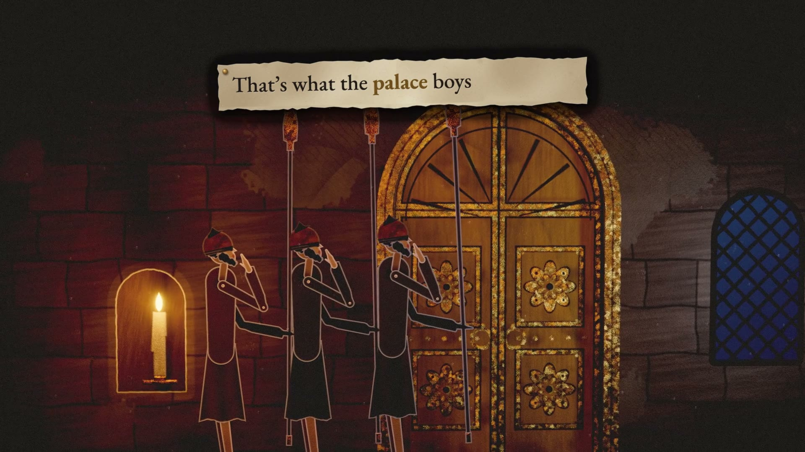

# Don't Knock, He's Busy

A song and code-rendered lyric film of Judges 3: Moab's eighteen years of tribute, Ehud the left-handed Benjamite and his double-edged secret, King Eglon in his summer room, the guards who were too polite to knock, the horn on Ephraim's hill, the fords of the Jordan, and the eighty quiet years.

Built with the Ark engine: https://github.com/omiron33/ark-video-studio



The film runs **3:02** at **1920 × 1080 / 60 fps** in a dark biblical papercraft style: every set is a miniature diorama of torn cardstock, parchment, pulp, black card, tarnished foil, thin wood and thread, lit by candles, torches and moonlight, and every person is an articulated paper puppet that moves a step at a time like stop-motion. All of it is drawn in code on the GPU. The paper, its fibres and torn edges, the foil, the ink and the light passing through the sheets are simulated; nothing in the picture is a photograph, a downloaded model or a generated image. The words are printed on torn parchment strips and a hanging wooden sign, stamped on the sung onset of each word.

The deed itself is shown only as shadow theatre behind a lit parchment screen, with no gore. Ehud is God's deliverer; Eglon is rotund and vain but still a king.

## Quick start

Install Node.js 22 or later, Google Chrome and FFmpeg (`ffmpeg` and `ffprobe` on your PATH), then:

```sh
npm ci
npm run validate
npm run still -- --scene s12-dagger --time 55.3 --samples 2
```

The still appears in `out/portable/stills/` (the picture, and the picture with its words as `-full.png`). Set the `CHROME` environment variable if Chrome is installed outside the platform's usual location.

For the complete film, place the original 48 kHz stereo recording at `media/song.wav` and run:

```sh
npm run render -- --draft
npm run render
```

The repository's own renderer (`renderer/`, `tools/render.mjs`) renders the film on its own; nothing else needs to be installed. See [rendering](docs/RENDERING.md) for scene clips, requirements and limitations.

## Source layout

- `film.json`: scene order and timings (43 scenes, cut on measured beats) and the film-wide lyric backing.
- `scenes/`: one picture module and one lyric module per scene.
- `lib/paper.js`: the paper diorama renderer: sheets at depth, traced front to back, lit by candles, torches, moonlight and shafts that cast soft shadows through and glow through the paper.
- `lib/puppet.js`: the articulated paper puppets (Ehud, Eglon, the guards, the people of Israel and Moab).
- `lib/x-*.js`: the worlds: the book (`x-book`), the road and the palace (`x-road*`), the summer room, the shadow theatre and the porch (`x-throne*`), the antechamber and the cutaway palace (`x-door*`), the night escape (`x-escape*`), and the hill country of Ephraim and the fords (`x-ephraim`).
- `lib/words.js`: the typography: parchment strips, letterpress stamping and the wooden chorus sign. `lib/sync.js` reads the measured drums and loudness.
- `data/`: aligned sung words and lines, and measured musical timing.
- `fonts/`: Bebas Neue and Anton.
- `renderer/`: deterministic browser rendering and local FFmpeg encoding.
- `tools/`: rendering, validation and the optional planning and timing utilities.
- `intake/sung-lyrics.txt`, `intake/official-lyrics.txt`: the lyrics.

[Storyboard](docs/STORYBOARD.md) · [Scene architecture](docs/AUTHORING.md) · [Rendering](docs/RENDERING.md) · [Credits and licenses](docs/CREDITS.md)

## License

Source code is released under the [MIT License](LICENSE). Fonts retain their SIL Open Font License notices (see [credits](docs/CREDITS.md)). The song recording and the finished film are separate media releases; the source-code license does not grant any rights to the recording, its lyrics as a recorded work, or the rendered film.
